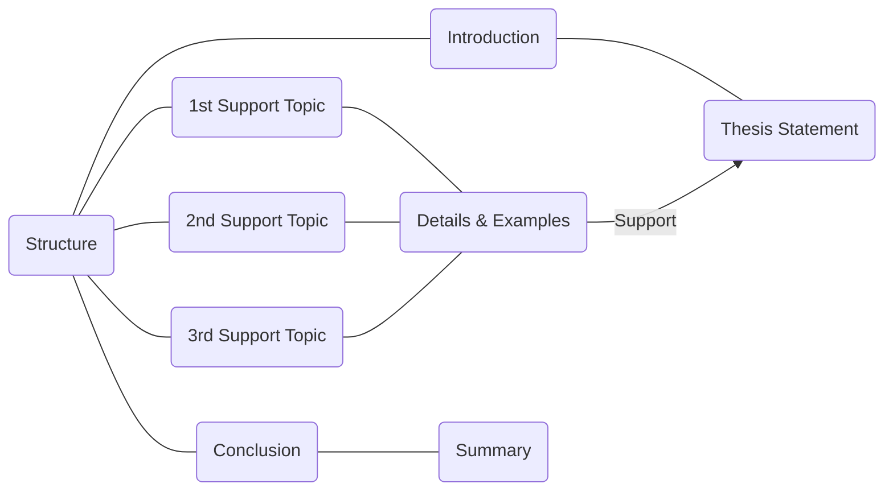
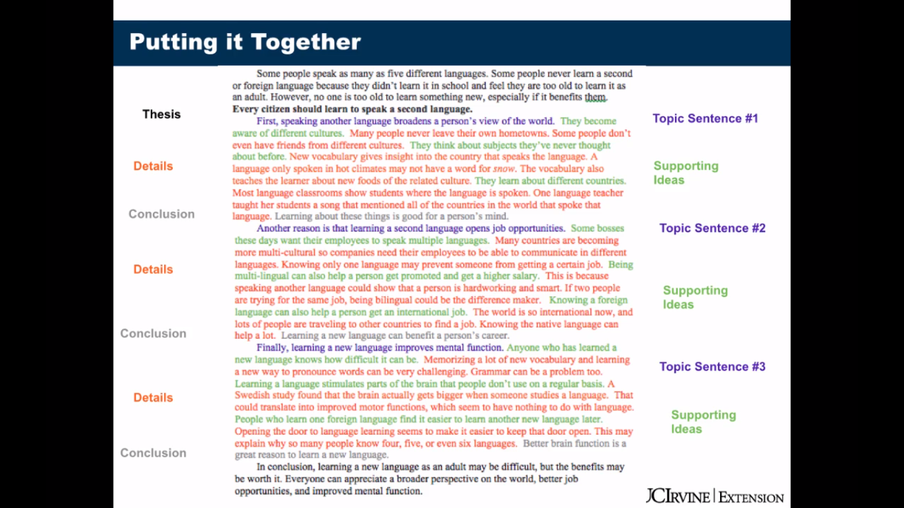

[TOC]

# Introduction to Essays

## What is an Essay?

- A piece of writing about one topic
- Several paragraphs or more

### Parts of an Essay

- Title

  It tells you what the essay is going to be about.

- Introduction

  It has some background information or other general **statements** about the topic.

- Body paragraphs

  Each essay need at least two body paragraphs; The body statements help to develop the thesis statement. That means they give reasons and examples. That help to prove the thesis statement.

- Conclusion

  A conclusion wraps up the essay. You might summarize your main points pr restate your thesis.

### Types of Essays

- Illustration

  It is a kind of essay that supports a thesis using example, shows the reader something through examples.

- Argument

  It is a kind of essay that proves a point by giving reasons, each body paragraph will give another reason to support the thesis.

- Classification

    It divides a topic into categories and each body paragraph will be a separate category.

- Compare/Contrast

  It is a type of essay that show the similarities between two things or the differences between two things.

- Cause/Effect

  It will describe the causes of something or the effects of something.

### Rules of Academic Essays

- Use 3rd  person pronouns
- Cite your source
- Use correct  grammar and punctuation
- Use correct format 
  - handwrite, typed, MLA, APA

### Different Kinds of Essays

- Description

  A place or event

- Narration

  A story

- Process

  How to do something

- Definition

## Introduction Paragraphs

- Hooks, Funnels, and Thesis Statements

### Hooks

- Attract attention
- Create interest
- Make the reader want to continue

#### Surprising Statement

- Some people may not realize that McDonald's hamburgers can last for many years without rotting.

#### Anecdote(story)

#### Questions

- What makes teenagers lie to their parents?

#### Quotation

- Andy Warhol wisely pointed out that "As soon as you stop wanting something, you  get it."

#### Statistic

### Funnels

- General statements/ Hook
- More specific statements
- Thesis statement
  - **topic**(topic is the subject or the thing that you are taking about)  + **controlling idea**(is what you want to say about the topic, it's where your argument is)

### Things to Avoid

- Don't announce your thesis(same as "*I will give*")
- Don't write a fact(fact is not arguable)
- Don't write a popular opinion
- Don't use pronouns, be specific
- Don't forget the two parts

### Sample Thesis Statements

Iceland is a beautiful country to visit to learn about a new culture.

- The topic is Iceland, and the controlling idea is that it is a beautiful place to learn about a new culture.

### What is Wrong with These Thesis Statements?

- It's important to change it because it will protect the environment.
- I will give four reasons why Germany won the Cup World.
- People should stop smoking because it is dangerous for health and is a dirty habit.
- Saving money is important.

# More about Writing Essays

## Body Paragraphs

### Structure of a Body Paragraphs

- Topic Sentence
  - Supporting idea #1
    - details and examples

  - Supporting idea #2
    - details and examples

  - Supporting idea #3
    - details and examples
- Conclusion or Sentence Transition

### Topic Sentence

- Two parts
  - topic and controlling idea
- Must support the thesis statement(must be specific!)
- Must have keywords and/or a transition
- Avoid pronouns!

### Supporting Ideas

- Topic Sentence
  - support #1
  - support #2
  - support #3

### Example

### Coherence

- Smoothness between sentences and paragraphs
- Makes your writing logical 
- Do this with transition words and phrases(same as, first, another reason, finally, etc.)
  - For example, also, furthermore...

## Paragraph Basic

How to Write a Paragraph.

### Topic Sentences

- Tell what the paragraph will be about.
- Must have a **topic** and **controlling idea**
- Indicates the type of paragraph

### Check Unity and Coherence

