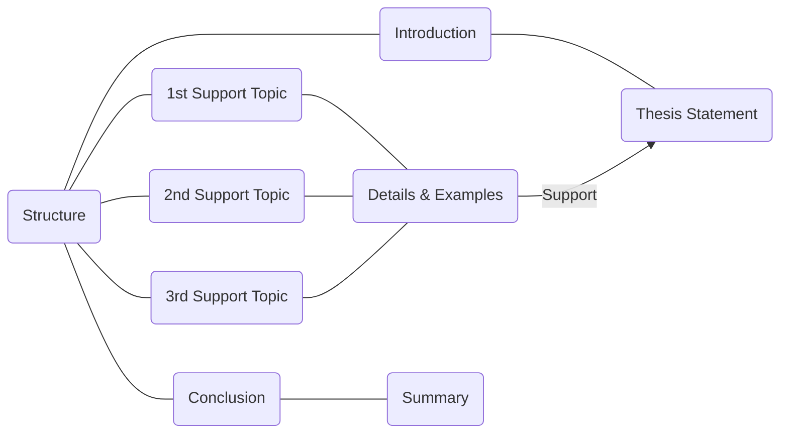

[TOC]

## What is an essay?

- A piece of writing about one topic
- Several paragraphs or more

### Parts of an essay

- Title

  It tells you what the essay is going to be about.

- Introduction

  It has some background information or other general **statements** about the topic.

- Body paragraphs

  Each essay need at least two body paragraphs; The body statements help to develop the thesis statement. That means they give reasons and examples. That help to prove the thesis statement.

- Conclusion

  A conclusion wraps up the essay. You might summarize your main points pr restate your thesis.

### Types of Essays

- Illustration

  It is a kind of essay that supports a thesis using example, shows the reader something through examples.

- Argument

  It is a kind of essay that proves a point by giving reasons, each body paragraph will give another reason to support the thesis.

- Classification

    It divides a topic into categories and each body paragraph will be a separate category.

- Compare/Contrast

  It is a type of essay that show the similarities between two things or the differences between two things.

- Cause/Effect

  It will describe the causes of something or the effects of something.

### Rules of Academic Essays

- 0Use 3rd  person pronouns
- Cite your source
- Use correct  grammar and punctuation
- Use correct format 
  - handwrite, typed, MLA, APA

### Different Kinds of Essays

- Description

  A place or event

- Narration

  A story

- Process

  How to do something

- Definition

