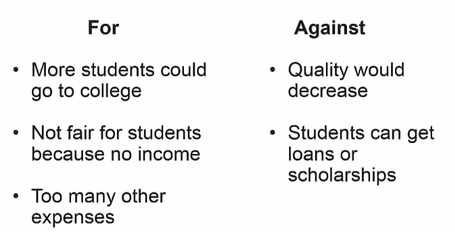

[TOC]

# Writing Argument Essays

After you learn the Argument video lecture, you will be able to:

- Identify debatable and non-debatable statements
- Identify and write effective thesis statements for an argument essay
- describe the characteristics of an argument essay

## Argument Essays

### What's Argument

- *Argument* means *persuasion*.
- Pick a side of an argument and try to define it.
- When you write this essay, you will focus on only one side of argument. Don't try to explain both sides.

### Sample Argument Topics

- University tuition costs should be decreased
- Steroids should be legal
- Students who are caught cheating should be expelled
- Professional athletes male too much money

## Before You Write

- Think about your topic
  - It must be **debatable**
- Decide your position
- Decide how to convince your reader
- Consider opposing points

## Thesis Statement

- Needs to indicate the topic and your position on the topic
- Make sure it is debatable 
- It can indicate what the body paragraphs will about or not

## Consider Opposing Points

University tuition costs should be decreased.

## Kinds of Body Paragraphs

- Reasons
- Answer to opposition
- Example

