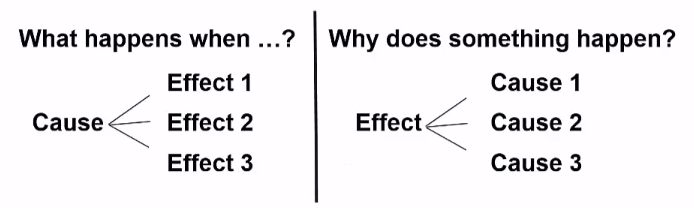
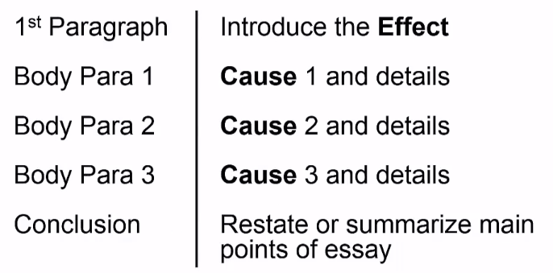
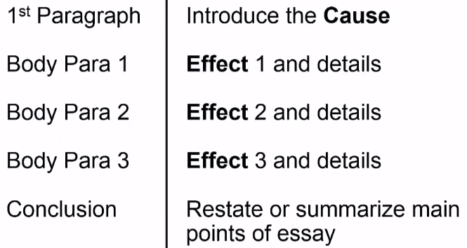
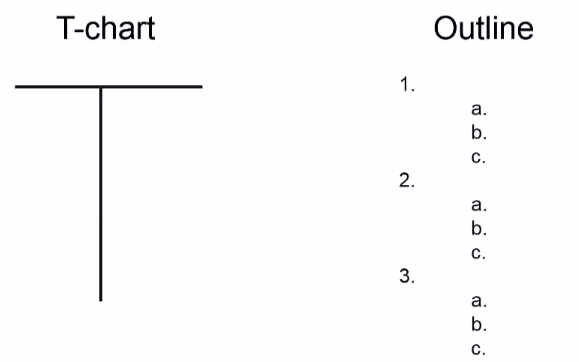

[TOC]

# Writing Cause/Effect Essays

After you learn the Cause/Effect video lecture, you will be able to:

- identify transitions that indicate cause or effect
- identify effective thesis statements for a cause/effect essay
- explain the characteristics of a cause/effect essay

## Cause/Effect Essays

### What's Cause/Effect?

- *Cause* means *what makes something happen*. A synonym is reason.
- *Effect* means *what happens as as result*.
- When you write this essay, you need to focus on either causes or effects, not both!

## Before You Write

- Think about your topic
- Make a plan

### Thesis Statement

- Needs to indicate whether you are writing about causes or effects.
- It can indicate what the body paragraphs will be about or not.

### Outline for Cause Essay

### Sample Cause Essay

Why are more people studying a second or third language?

- They want to try to get a better job.
- They want to be able to interact internationally. 
- They want to improve themselves.

### Outline for Effect Essay

### Sample Effect Essay

What usually happens after a stock market crash?

- People get scared and take their money out of the stock market.
- The government makes new regulations to prevent another crash.
- Companies shrink and lay off employees.

## Planning

- When you write cause/effect essay, think about whether you want to write about causes OR effects.
- Plan one cause or one effect for each body paragraph.
- Make an outline to plan each paragraph.

Put causes on one side and effects on the other.