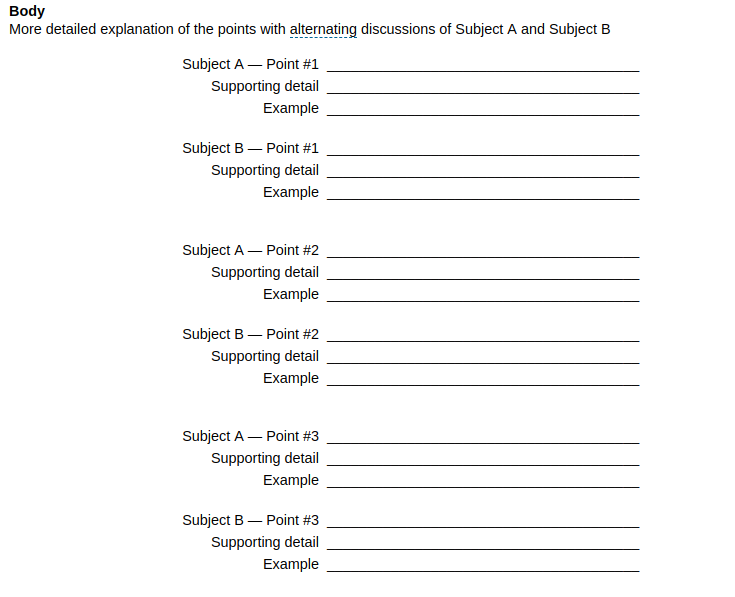

[TOC]

# Writing Compare/Contrast Essays

After you learn the Compare/Contrast video lecture, you will be able to:

- identify transitions that show compare or contrast
- identify effective thesis statement for compare/contrast essays
- explain several characteristics of compare/contrast essays

## Compare/Contrast Essays

### What is Compare/Contrast Essays

- **Compare** means to look at what is **similar** between two things.
- **Contrast** means to look at what is **different** between two things.
- Sometimes a compare/contrast essay is just called **comparison**.

### Before You Write

- Think about your topic
- Make a plan

When we write a comparison essay, we often use these two types of diagrams.

On the left we have what's called a **Venn diagram**; Another type of  diagram you can use for preparing you compare or contrast essay is just a **T chart**.

#### Venn Diagrams for Contrast/Compare

### Thesis Statement

- Mention the **two things** you are comparing or contrasting in your thesis statement.
- Indicate whether you will compare or contrast.

### Method of Organization

In the picture above A is similar, B is different.

### Planning Your Essay

- You will use point-by-point method
- Make a Venn Diagram or T chart
- Plan on similarity or difference for each body paragraph

## Appendix

### Outline for a Compare and Contrast Essay: Point by Point

This is an example of outline for a Point by Point type of Compare and Contrast Essay. Use this example outline as a guideline when writing a compare and contrast essay outline.

