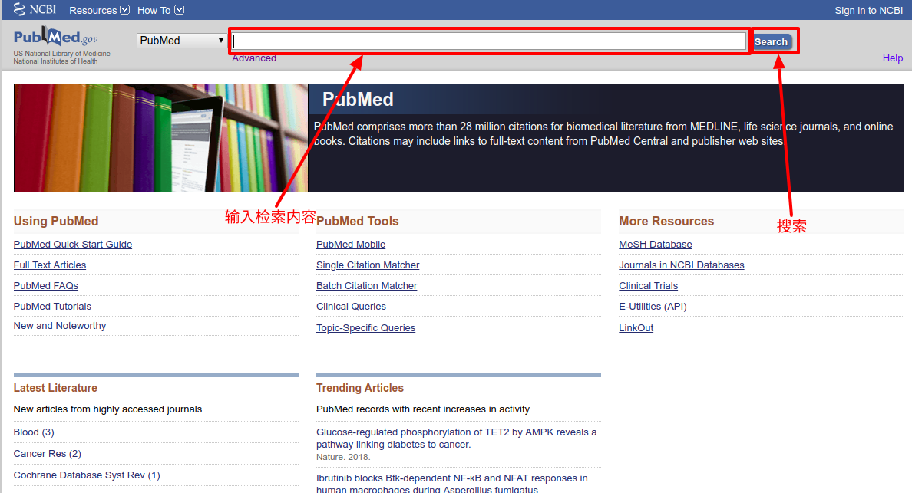
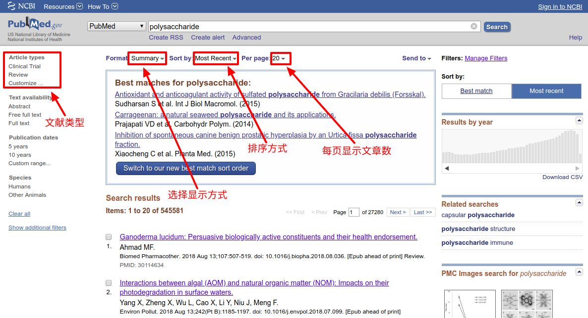
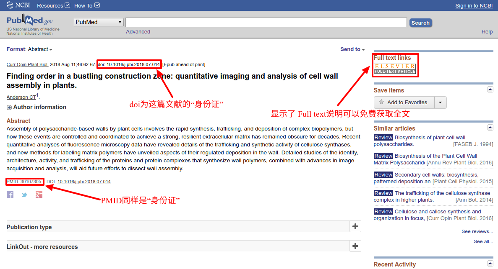
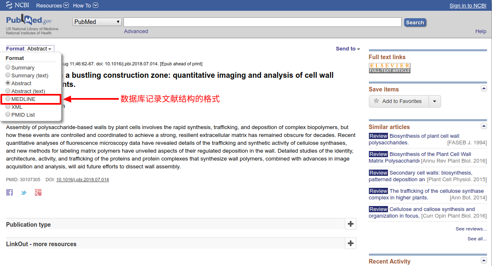
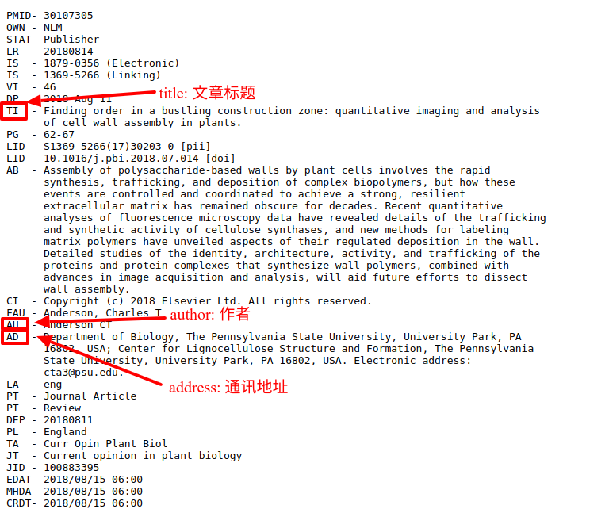
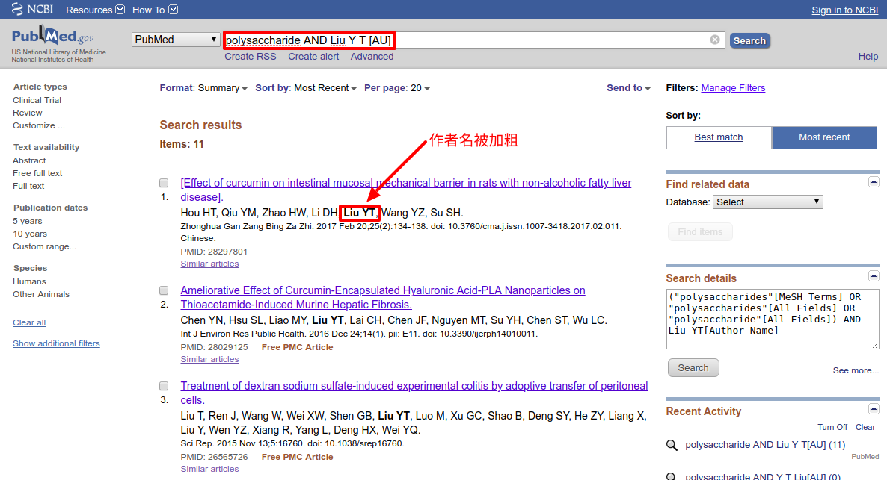

[TOC]

# 常用数据库

## PubMed

PubMed拥有超过两千四十万的生物医学文献。它们来源于MEDLINE（生物医学文献数据库）、生命科学领域学术杂志以及在线的专业书籍。这些文献部分提供全文链接。

现在我们在PubMed的首页检索框内输入你想要检索的内容，比如我想检索"polysaccharide"相关信息，检索后可以看到以下界面。

在这个界面下你可以选择你的想检索的文献类型，比如你想快速了解某个领域就去找这个领域的综述（Review）类文献；还可以选择检索出来的文献列表的显示方式，默认的是Summary，除此之外，比如你想在浏览文献列表的时候显示摘要（Abstract），那么你可以选择Abstract；在Format的旁边有个排序选项，你可以在这里选择检索出来的文献的排序方式，默认的是按时间排序，此外，你还可以选择按照匹配度，期刊等来进行排序；最后是选择每页显示的文献数目，默认每页显示20篇文献，当然你可以设置显示更多。

我们通过浏览检索结果选择一篇自己感兴趣的文章，点击进去。PubMed提供文献摘要和全文链接。值得注意的是大多文献是要付费的，付费文献你只能免费浏览它的摘要，当然，你也能看到这篇文献的**doi**和**PMID**，这两个东西相当于这篇文献的"身份证"；当你检索文献时发现显示了类似"Full text"的字样的，这种文献就可以免费浏览全文和下载，像在上图中就显示了"Full text"，并且全文链接指向了ELSEVIER（爱思唯尔 是一家信息和解析公司和世界上科学、技术和医学信息的主要提供者之一）。

这里还值得注意的一点是在Format这个下拉菜单中我们可以发现一个MEDLINE的选项，我们选择这个选项后可以得到下面这幅图的内容。实际上MEDLINE给我们提供了数据库记录这篇文献结构的格式，比如"AU"代表作者，"TI"代表文献标题，"AD"代表通讯地址等。了解了这些为我们后面涉及到的**高级检索**（Advanced）提供了思路。

我们可以在检索框中除了输入之前我们想检索的多糖外，我们还可以加上作者，比如我们输入"Liu Y T[AU]"，注意这里我在作者名字后加入了"[AU]"，代表我要检索的这个在文章结构中属于作者。随后点击检索我们可以得到关于这个指定作者发表的有关多糖的文章。

关于使用PubMed的几个建议：

- 使用引号，使用引号的好处是被引号框住的次会被数据库当做一个整体，这个方法同样适用于度娘和Google等；
- 使用逻辑词AND，OR，NOT等；
- 使用正确的名字缩写；
- 使用每篇文献的唯一PubMed ID也就是PMID。

当然PubMed不是万能的，比如：

- 搜索不了1995年以前的文献中排名十位以后的作者；
- 1976年以前的文献只有标题没有摘要；
- 搜索1965年前的文章，呵呵...

好了，关于PubMed的介绍就介绍到这里啦！