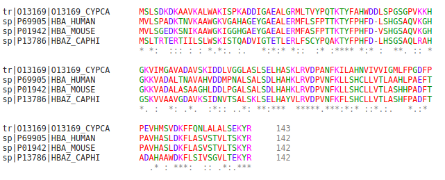

[TOC]

# 多序列比对

多序列比对（Multiple sequence alignment）是对两条以上的生物序列进行**全局比对**。

- 多序列比对的主要用途：

  1. **确认**：一个未知的序列是否属于某个家族
  2. **建立**：系统发生树，查询物种间或者序列间的关系
  3. **模式识别**：一些特别保守的序列片段往往对应重要的功能区域，通过多序列比对，可以找到这些保守片段
  4. **已知推未知**：把已知有特殊功能的序列片段通过多序列比对做成模型，然后根据该模型推测未知的序列片段是否也具有该功能
  5. **其他**：预测蛋白质/RNA二级结构等等

- 多序列比对算法

  目前所有的多学列比对工具都不是完美的，它们都使用一种近似算法。为了是提高速度，损失一点精确度是值得的。

- 对要进行多序列比对的序列的几点要求：

  1. **太多**的序列受不了。一般10-15条序列，最好不超过50条，序列太多任何软件都受不了！
  2. **关系太远**的序列受不了。两两之间系列相似度低于30%的一组序列，做多序列比对会有麻烦
  3. **关系太近**的序列受不了。两两之间序列相似度大于90%的序列，有再多条都等于**一条**
  4. **短序列**受不了。多序列比对支持一组差不多的序列，个别很短的序列属于捣乱分子
  5. 有**重复域**的序列受不了。如果序列里包含重复域，大多数多序列对比都会出错，甚至崩溃

- 序列名字有几点建议：

  1. 名字里不要有空格，用“_”代替“空格”（这也是一个程序猿的基本修养）
  2. 不要用特殊字符，比如中文，@，#等
  3. 名字的长度不要超过15个字符
  4. 一组序列里，不要有重名的序列
  5. 如果不按照上述几点建议命名，多序列比对工具会在你不知道的情况下修改你的序列名称！

- 在线多序列比对工具分类及部分常用工具：

  - Clustal - 最常用的多序列比对工具

  - TCOFFEE - 最新的多序列比对工具之一

    算法上和Clustal相似，准确度比Clustal系列略高，但计算时间也更长。

  - MUSCLE - 最快的多序列比对工具

    |  网站名称   |  服务器位置   |                     网址链接                      |
    | :---------: | :-----------: | :-----------------------------------------------: |
    |     EBI     | Clustal-Omega |     https://www.ebi.ac.uk/Tools/msa/clustalo/     |
    |   Expasy    |   Clustal W   | https://embnet.vital-it.ch/software/ClustalW.html |
    | Sfi-Clustal |  Clusal O/W2  |          http://www.clustal.org/(仅下载)          |
    |     EBI     |    Tcoffee    |     https://www.ebi.ac.uk/Tools/msa/tcoffee/      |
    |   TCOFFEE   |    Tcoffee    |                http://tcoffee.org/                |
    |     EBI     |    Muscle     |      https://www.ebi.ac.uk/Tools/msa/muscle/      |
    |   MUSCLE    |    Muscle     |         http://drive5.com/muscle/(仅下载)         |

- EBI的Clustal-Omega应用举例：

  1. 打开网址

     

  2. 输入需要比对的序列，这里我以下面的蛋白质序列为例，为fasta格式文件

     ```
     >tr|O13169|O13169_CYPCA Alpha-globin OS=Cyprinus carpio GN=No.3 alpha PE=3 SV=1
     MSLSDKDKAAVKALWAKISPKADDIGAEALGRMLTVYPQTKTYFAHWDDLSPGSGPVKKH
     GKVIMGAVADAVSKIDDLVGGLASLSELHASKLRVDPANFKILAHNVIVVIGMLFPGDFP
     PEVHMSVDKFFQNLALALSEKYR
     >sp|P69905|HBA_HUMAN Hemoglobin subunit alpha OS=Homo sapiens GN=HBA1 PE=1 SV=2
     MVLSPADKTNVKAAWGKVGAHAGEYGAEALERMFLSFPTTKTYFPHFDLSHGSAQVKGHG
     KKVADALTNAVAHVDDMPNALSALSDLHAHKLRVDPVNFKLLSHCLLVTLAAHLPAEFTP
     AVHASLDKFLASVSTVLTSKYR
     >sp|P01942|HBA_MOUSE Hemoglobin subunit alpha OS=Mus musculus GN=Hba PE=1 SV=2
     MVLSGEDKSNIKAAWGKIGGHGAEYGAEALERMFASFPTTKTYFPHFDVSHGSAQVKGHG
     KKVADALASAAGHLDDLPGALSALSDLHAHKLRVDPVNFKLLSHCLLVTLASHHPADFTP
     AVHASLDKFLASVSTVLTSKYR
     >sp|P13786|HBAZ_CAPHI Hemoglobin subunit zeta OS=Capra hircus GN=HBZ1 PE=3 SV=2
     MSLTRTERTIILSLWSKISTQADVIGTETLERLFSCYPQAKTYFPHFDLHSGSAQLRAHG
     SKVVAAVGDAVKSIDNVTSALSKLSELHAYVLRVDPVNFKFLSHCLLVTLASHFPADFTA
     DAHAAWDKFLSIVSGVLTEKYR
     ```

     将比对序列粘贴后，第二步我们通常使用默认参数。

     

  3. 最后点击提交即可获得比对结果。值得注意的是在多序列比对的最后一行有一段由"\*:."构成的字符串，这里的"\*:."和双序列比对里的含义略有不同。其中"\*"代表这一列完全保守，也就是说这一列里的字母完全相同；":"代表这一列有相似的亲疏水性和分子大小；"."代表这一列含有不相似的；最后如果什么都没有代表这一列是完全不保守的，也就是说这一列字母完全不同！

     

     

     这里我们再来看"Result Summary"选项 

     

     ```
     #
     #
     #  Percent Identity  Matrix - created by Clustal2.1 
     #
     #
     
          1: tr|O13169|O13169_CYPCA  100.00   50.00   50.70   47.18
          2: sp|P69905|HBA_HUMAN      50.00  100.00   85.92   56.34
          3: sp|P01942|HBA_MOUSE      50.70   85.92  100.00   56.34
          4: sp|P13786|HBAZ_CAPHI     47.18   56.34   56.34  100.00
     ```

     可以得到两两序列之间的一致度矩阵，这个一致度矩阵第一行省略掉了，因为它和这个矩阵的第一列是一样的，因此这个矩阵是沿对角线对称的。这个矩阵可以更好地帮助我们了解这些序列之间的关系，比如我们可以发现序列sp|P69905|HBA_HUMAN和序列sp|P01942|HBA_MOUSE的一致度是最高的。

     除了通过一致度矩阵了解序列之间的关系，还可以通过Phylogenetic Tree了解，虽然这个叫做"系统发生树"，但是结果实际上不是真正意义上的系统发生树，它只是在创建多序列比对的过程中创建的一个树，并没有经过距离矫正！

     

- 多序列比对保存格式

  无论用那种工具，最后都会提供很多保存格式，所以到底应该选择保存何种格式呢？我们需要注意下面几个问题：

  1. 大多数软件都支持我选的这个格式吗？
  2. 我的小伙伴们能使用我选的这个格式吗？
  3. 这个格式能保存我所需要的所有信息吗？
  4. 这个格式适合我进一步加工吗？

  如果比对工具输出格式没有我想要的，那么可以通过第三方软件进行格式转换：

  - https://www.bioinformatics.org/JaMBW/1/2/index.html

- 多序列对的编辑和发布

  |   名称   |                       网址                        |        特点        |
  | :------: | :-----------------------------------------------: | :----------------: |
  | JalView  |              http://www.jalview.org/              | JAVA，可以嵌入网页 |
  | Boxshade | https://embnet.vital-it.ch/software/BOX_form.html |    擅长做黑白图    |
  | ESPript  |      http://espript.ibcp.fr/ESPript/ESPript/      |     功能很强大     |
  |  MView   |          https://desmid.github.io/mview/          | 擅长转化为HTML源码 |

- 多序列比对的意义-**寻找保守区域！**

  用一句话来描述你究竟想从多序列比对中获得什么的话，那就是寻找保守区域了！还记得之前我们提过的"\*"或":"表示的含义，因此在下图中我们关心的是"\*"和":"出现的区域，也就是保守区域。为了更好地寻找保守区域我们需要使用一些工具。

  

  在介绍工具之前，我们先来介绍**序列标识符**(Sequence logo)，它是以图形的方式依次绘出序列比对种各个位置上出现的残基。每个位置上的残基的累计可以反映出该位置上的残基一致性。每个残基对应图形字符的大小与残基在该位置上出现的频率成正比。但图形字符的大小并不等于频率的百分比，而是经过简单统计计算后转化的结果。

  一款流行的创建序列标识符的软件是WebLogo3（http://weblogo.threeplusone.com/）

- 寻找保守区域

  在核酸/蛋白质序列中存在有特定**模式**（pattern）的序列片段，这些片段称为序列的**基序**（motif）。序列基序与生物功能密切相关。

  例如，N-糖基化位点基序（N-glycosylation site motif）总是符合以下特定模式：*Asn*

  开始，然后紧跟除了*Pro*户外的任何一个氨基酸，再紧跟*Ser*或者*Thr*，再紧跟除*Pro*外的任何一个氨基酸。这个特定模式可以用**正则表达式**（Regular expression）来表达：

  ```bash
  N{P}[ST]{P}
  ```

  其中N=Asn，P=Pro，S=Ser，T=Thr；{X}表示除了X外的任意氨基酸；[XY]代表X或者Y。

  **MEME**（http://meme-suite.org/）是一款可以自动从一组相关的DNA序列或蛋白质序列种发现序列基序的软件。