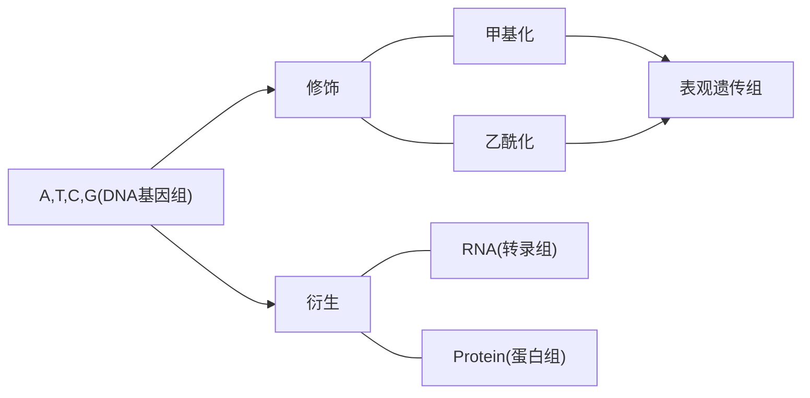

[TOC]

# 绪论

上帝语言的基本元素：$A, T, C, G$

## 测序的概念

测序是对生命语言中的基本元素，及修饰和衍生物进行测定和解读

包括：

1. DNA测序
2. RNA测序
3. 蛋白组测序
4. 表观遗传测序
5. ...

人类３０亿碱基

## 第一代测序技术

- ABI

基于第一代测序技术的人类基因组计划(HPG)

## 高通量测序技术(NGS)

- Roche
- ***Illumina***
  - Genome Analyzer
  - HiSeq 2000
  - HiSeq 2500
  - HiSeq X-ten 
- Life Technologies
- Complete Genomics

## 第三代测序技术

- Pacific Biosciences

## 高通量测序技术的应用

- 无创产前检测
- 个人基因检测
- 癌症基因检测的个体化治疗

## 癌症基因组测序

- 癌症全基因组重测序
- 癌症全外显子测序
- 癌症基因靶向测序

## 基因组测序能分析什么？

- 单碱基(SNV)及小片段(Indel)变异：外显子测序或者靶向测序
- DNA拷贝数变异(CNV)
- DNA结构变异(SV)

## 基因组测序文章阅读分析套路

1. 样本是什么？
2. 测的什么？
3. 找到那些变异？
4. 这些变异是怎么注释的？

