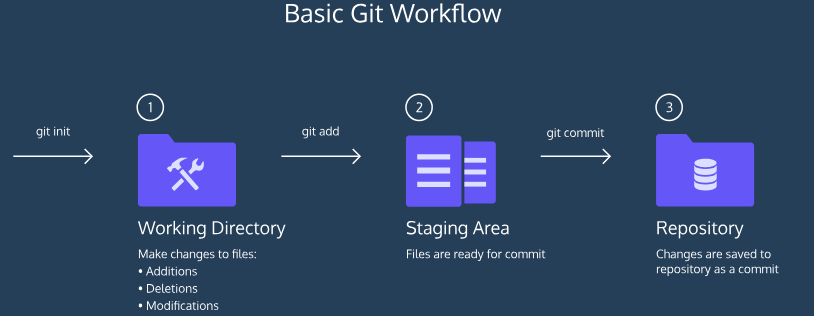

[TOC]

## BASIC GIT WORKFLOW

An introduction to Git and a few of its core features. 

 ### Hello Git

Git is a software that <u>allows you to keep track of changes made to a project over time</u>. Git works by recording the changes you make to a project, storing those changes, then allowing you to reference them as needed.

We'll learn Git by using it to help us write a screenplay called *Harry Programmer and the Sorcerer's Code*.

We’ll get started by taking a look at the screenplay project.

 In **scene-1.txt**, add this text:

```
Harry Programmer and the Sorcerer’s Code: Scene 1
```

### git init

Now that we have started working on the screenplay, let’s turn the **sorcerers-code **directory into a Git project. We do this with:

```bash
git init
```

The word `init` means *initialize*. The command sets up all the tools Git needs to begin tracking changes made to the project.

In the terminal, initialize a new Git project.

Notice the output:

```bash
Initalized an empty git repository in /home/ccuser/workspace/sorcerers-code/.git/
```

The Git project was created.

### Git Workflow

Nice! We have a Git project. A Git project can be thought of as having three parts:

1. A *Working Directory*: where you'll be doing all the work: creating, editing, deleting and organizing files
2. A *Staging Area*: where you'll list changes you make to the working directory
3. A *Repository*: where Git permanently stores those changes as different *versions* of the project



The Git workflow consists of editing files in the working directory, adding files to the staging area, and saving changes to a Git repository. In Git, we save changes with a *commit*, which we will learn more about in this lesson.

### git status

As you write the screenplay, you will be changing the contents of the working directory. You can check the status of those changes with:

```bash
git status
```

From the terminal, check the status of the **sorcerers-code** project.

In the output, notice the file in red under `untracked files`. Untracked means that Git sees the file but has not started tracking changes yet.

### git add

In order for Git to start tracking **scene-1.txt**, the file needs to be added to the staging area.

We can add a file to the staging area with:

```bash
git add filename
```

The word `filename` here refers to <u>the name of the file you are editing</u>, such as **scene-1.txt**.

Now, let's add **scene-1.txt** to the staging area in Git. Recall that you will need to identify the file by its name.

Check the status of the project in Git.

In the output, notice that Git indicates the changes to be committed with "new file: scene-1.txt" in green text. Here Git tells us the file was added to the staging area.

### git diff

Good work! Now you know how to add a file to the staging area.

Imagine that we type another line in **scene-1.txt**. Since the file is tracked, we can check the differences between the working directory and the staging area with:

```bash
git diff filename
```

Here, `filename` is the actual name of the file. If the name of my file was **changes.txt** the command would be

```bash
git diff changes.txt
```

In the code editor, add this text to **scene-1.txt**:

```
Dumblediff: I should've known you would be here, Professor McGonagit.
```

From the terminal, use the new command to check the difference between the working directory and the staging area.

```bash
$ git diff scene-1.txt
diff --git a/scene-1.txt b/scene-1.txt
index 913b994..258fda4 100644
--- a/scene-1.txt
+++ b/scene-1.txt
@@ -1 +1,2 @@
 Harry Programmer and the Sorcerers Code: Scene 1
+Dumblediff: I should've known you would be here, Professor McGonagit.
\ No newline at end of file
```

Notice the output:

- "Harry Programmer and the Sorcerer's Code: Scene 1" is in the staging area, as indicated in white.

- Changes to the file are marked with a `+` and are indicated in green.

  **IMPORTANT**: press `q` on your keyboard to exit diff mode.

Add the changes to the staging area in Git. Recall that you will need to identify the file by its name.

### git commit

A *commit* is the last step in our Git workflow. A commit permanently stores changes from the staging area inside the repository.

`git commit` is the command we'll do next. However, one more bit of code is needed for a commit: the *option* `-m` followed by a message. Here's an example:

```bash
git commit -m "Complete first line of dialogue"
```

Standard Conventions for Commit Messages:

- Must be in quotation marks
- Written in the present tense
- Should be brief (50 characters or less) when using `-m`

Now, let's make your first commit! From the terminal, type the command along with a commit message. The message should describe the point of the commit.

If you're having trouble thinking of a good commit message, <u>reflect on how the project has changed since it began.</u>

### git log

Often with Git, you'll need to refer back to an earlier version of a project. Commits are stored chronologically in the repository and can be viewed with:

```bash
git log
```

From the terminal, log a list of your commits.

```bash
$ git log
commit 8368846f86a477bc7e68c169f298e65e0ae18b17
Author: codecademy <ccuser@codecademy.com>
Date:   Wed Aug 8 15:36:59 2018 +0000

    now
```

In the output, notice:

- A 40-character code, called a *SHA*, that uniquely identifies the commit. This appears in orange text.
- The commit author (you!)
- The date and time of the commit
- The commit message

### Generalizations

You have now been introduced to the fundamental Git workflow. You learned a lot! Let's take a moment to generalize:

- Git is the industry-standard version control system for web developers
- Use Git commands to help keep track of changes made to a project:
  - `git init` creates a new Git repository
  - `git status` inspects the contents of the working directory and staging area
  - `git add` adds files from the working directory to the staging area
  - `git diff` shows the difference between the working directory and the staging area
  - `git commit` permanently stores file changes from the staging area in the repository
  - `git log` shows a list of all previous commits