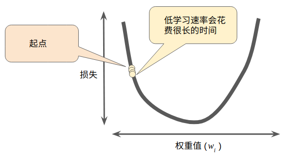
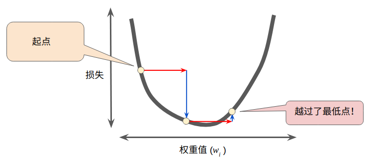
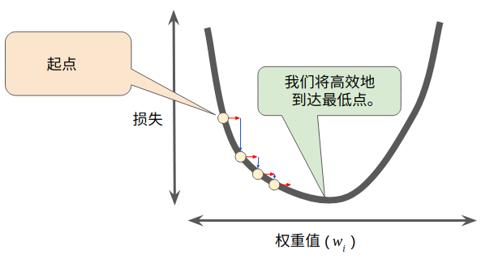

[TOC]

# ML主要术语

什么是（监督式）机器学习？简单来说，它的定义如下：

- 机器学习系统通过学习如何组合输入信息来对从未见过的数据做出有用的预测。

下面我们来了解一下机器学习的基本术语。

## 标签

**标签**是我们要预测的事物，即简单线性回归中的 `y` 变量。标签可以是小麦未来的价格、图片中显示的动物品种、音频剪辑的含义或任何事物。

## 特征

**特征**是输入变量，即简单线性回归中的 `x` 变量。简单的机器学习项目可能会使用单个特征，而比较复杂的机器学习项目可能会使用数百万个特征，按如下方式指定：
$$
\{x_1, x_2, \cdots, x_N\}
$$
在垃圾邮件检测器示例中，特征可能包括：

- 电子邮件文本中的字词
- 发件人的地址
- 发送电子邮件的时段
- 电子邮件中包含“一种奇怪的把戏”这样的短语。

## 样本

**样本**是指数据的特定实例：**x**。（我们采用粗体 **x** 表示它是一个矢量。）我们将样本分为以下两类：

- 有标签样本
- 无标签样本

**有标签样本**同时包含特征和标签。即：

```python
labeled examples: {features, label}: (x, y)
```

我们使用有标签样本来**训练**模型。在我们的垃圾邮件检测器示例中，有标签样本是用户明确标记为“垃圾邮件”或“非垃圾邮件”的各个电子邮件。

例如，下表显示了从包含加利福尼亚州房价信息的[数据集](https://developers.google.com/machine-learning/crash-course/california-housing-data-description)中抽取的 5 个有标签样本：

| housing Median Age | total Rooms | total Bedrooms | median House Value |
| :----------------: | :---------: | :------------: | :----------------: |
|         15         |    5612     |      1283      |       66900        |
|         19         |    7650     |      1901      |       80100        |
|         17         |     720     |      174       |       85700        |
|         14         |    1501     |      337       |       73400        |
|         20         |    1454     |      326       |       65500        |

**无标签样本**包含特征，但不包含标签。即：

```python
unlabeled examples: {features, ?}: (x, ?)
```

在使用有标签样本训练了我们的模型之后，我们会使用该模型来预测无标签样本的标签。在垃圾邮件检测器示例中，无标签样本是用户尚未添加标签的新电子邮件。

## 模型

模型定义了**特征**与**标签**之间的关系。例如，垃圾邮件检测模型可能会将某些特征与“垃圾邮件”紧密联系起来。我们来重点介绍一下模型生命周期的两个阶段：

- **训练**表示创建或**学习**模型。也就是说，您向模型展示有标签样本，让模型逐渐学习特征与标签之间的关系。
- **推断**表示将训练后的模型应用于无标签样本。也就是说，您使用训练后的模型来做出有用的预测 (`y'`)。例如，在推断期间，您可以针对新的无标签样本预测 `medianHouseValue`。

## 回归与分类

**回归**模型可预测连续值。例如，回归模型做出的预测可回答如下问题：

- 加利福尼亚州一栋房产的价值是多少？
- 用户点击此广告的概率是多少？

**分类**模型可预测离散值。例如，分类模型做出的预测可回答如下问题：

- 某个指定电子邮件是垃圾邮件还是非垃圾邮件？
- 这是一张狗、猫还是仓鼠图片？


# 深入了解机器学习 (Descending into ML)

## 线性回归

**线性回归**是一种找到最适合一组点的直线或超平面的方法。本模块会先直观介绍线性回归，为介绍线性回归的机器学习方法奠定基础。

人们[早就知晓](https://wikipedia.org/wiki/Dolbear's_law)，相比凉爽的天气，蟋蟀在较为炎热的天气里鸣叫更为频繁。数十年来，专业和业余昆虫学者已将每分钟的鸣叫声和温度方面的数据编入目录。Ruth 阿姨将她喜爱的蟋蟀数据库作为生日礼物送给您，并邀请您自己利用该数据库训练一个模型，从而预测鸣叫声与温度的关系。

首先建议您将数据绘制成图表，了解下数据的分布情况：


事实上，虽然该直线并未精确无误地经过每个点，但针对我们拥有的数据，清楚地显示了鸣叫声与温度之间的关系。只需运用一点代数知识，您就可以将这种关系写下来，如下所示：
$$
y = mx + b
$$
其中：

- $y$指的是温度（以摄氏度表示），即我们试图预测的值。
- $m$指的是直线的斜率。
- $x$指的是每分钟的鸣叫声次数，即输入特征的值。
- $b$指的是$y$轴截距。

按照机器学习的惯例，您需要写一个存在细微差别的模型方程式：
$$
y' = b + w_1x_1
$$
其中：

- $y′ $指的是预测[标签](https://developers.google.com/machine-learning/crash-course/framing/ml-terminology#labels)（理想输出值）。
- $b$指的是偏差（$y$轴截距）。而在一些机器学习文档中，它称为$w_0$。
- $w_1$指的是特征 1 的权重。权重与上文中用$m$表示的“斜率”的概念相同。
- $x_1$指的是[特征](https://developers.google.com/machine-learning/crash-course/framing/ml-terminology#features)（已知输入项）。

要根据新的每分钟的鸣叫声值$x_1$**推断**（预测）温度 $y′$，只需将 $x_1$ 值代入此模型即可。

下标（例如 $w_1$ 和 $x_1$）预示着可以用多个特征来表示更复杂的模型。例如，具有**三个特征**的模型可以采用以下方程式：
$$
y'=b+w_1x_1+w_2x_2 + w_3x_3
$$

## 训练与损失

简单来说，**训练**模型表示通过有标签样本来学习（确定）所有权重和偏差的理想值。在监督式学习中，机器学习算法通过以下方式构建模型：检查多个样本并尝试找出可最大限度地减少损失的模型；这一过程称为**经验风险最小化**。

损失是对糟糕预测的惩罚。也就是说，**损失**是一个数值，表示对于单个样本而言模型预测的准确程度。如果模型的预测完全准确，则损失为零，否则损失会较大。训练模型的目标是从所有样本中找到一组平均损失“较小”的权重和偏差。例如，下图左侧显示的是损失较大的模型，右侧显示的是损失较小的模型。关于此图，请注意以下几点：

- 红色箭头表示损失。

- 蓝线表示预测。

  

请注意，左侧曲线图中的红色箭头比右侧曲线图中的对应红色箭头长得多。显然，相较于左侧曲线图中的蓝线，右侧曲线图中的蓝线代表的是预测效果更好的模型。

您可能想知道自己能否创建一个数学函数（损失函数），以有意义的方式汇总各个损失。

### 平方损失：一种常见的损失函数

接下来我们要看的线性回归模型使用的是一种称为**平方损失**（又称为 **L~2~ 损失**）的损失函数。单个样本的平方损失如下：

```
  = the square of the difference between the label and the prediction
  = (observation - prediction(x))2
  = (y - y')2
```

**均方误差** (**MSE**) 指的是每个样本的平均平方损失。要计算 MSE，请求出各个样本的所有平方损失之和，然后除以样本数量：
$$
MSE = \frac{1}{N}\sum_{(x,y)\in D}(y - prediction(x))^2
$$
其中：

- $(x,y)$ 指的是样本，其中
  - $x$ 指的是模型进行预测时使用的特征集（例如，温度、年龄和交配成功率）。
  - $y$ 指的是样本的标签（例如，每分钟的鸣叫次数）。
-  $prediction(x)$指的是权重和偏差与特征集 $x$ 结合的函数。
- $D$ 指的是包含多个有标签样本即 $(x,y)$ 的数据集。
- $N $指的是 $D$ 中的样本数量。

 虽然 **MSE** 常用于机器学习，但它既**不是唯一**实用的损失函数，也不是适用于所有情形的最佳损失函数。

  

# 降低损失 (Reducing Loss)

为了训练模型，我们需要一种可降低模型损失的好方法。迭代方法是一种广泛用于降低损失的方法，而且使用起来简单有效。

**学习目标:**

- 了解如何使用迭代方法来训练模型。

- 全面了解梯度下降法和一些变体，包括：

- - 小批量梯度下降法
  - 随机梯度下降法

- 尝试不同的学习速率。

## 迭代方法

 [上一单元](https://developers.google.com/machine-learning/crash-course/descending-into-ml)介绍了损失的概念。在本单元中，您将了解机器学习模型如何以迭代方式降低损失。

迭代学习可能会让您想到“[Hot and Cold](http://www.howcast.com/videos/258352-how-to-play-hot-and-cold/)”这种寻找隐藏物品（如顶针）的儿童游戏。在我们的游戏中，“隐藏的物品”就是最佳模型。刚开始，您会胡乱猜测（“$w_1$ 的值为 $0$。”），等待系统告诉您损失是多少。然后，您再尝试另一种猜测（“$w_1$ 的值为 0.5。”），看看损失是多少。哎呀，这次更接近目标了。实际上，如果您以正确方式玩这个游戏，通常会越来越接近目标。这个游戏真正棘手的地方在于尽可能高效地找到最佳模型。

下图显示了机器学习算法用于训练模型的迭代试错过程：


我们将在整个机器学习速成课程中使用相同的迭代方法详细说明各种复杂情况，尤其是处于暴风雨中的蓝云区域。迭代策略在机器学习中的应用非常普遍，这主要是因为它们可以很好地扩展到大型数据集。

“模型”部分将一个或多个特征作为输入，然后返回一个预测 ($y'$) 作为输出。为了进行简化，不妨考虑一种采用一个特征并返回一个预测的模型：
$$
y′=b+w_1x_1
$$
我们应该为 $b$ 和 $w_1$ 设置哪些初始值？对于线性回归问题，事实证明初始值并不重要。我们可以随机选择值，不过我们还是选择采用以下这些无关紧要的值：

- $b = 0$
- $w_1 = 0$

假设第一个特征值是 10。将该特征值代入预测函数会得到以下结果：

```
  y' = 0 + 0(10)
  y' = 0
```

图中的“计算损失”部分是模型将要使用的[损失函数](https://developers.google.com/machine-learning/crash-course/descending-into-ml/training-and-loss)。假设我们使用平方损失函数。损失函数将采用两个输入值：

- $y'$：模型对特征 $x$ 的预测
- $y$：特征 $x$ 对应的正确标签。

最后，我们来看图的“**计算参数更新**”部分。机器学习系统就是在此部分检查损失函数的值，并为 $b$ 和 $w_1$ 生成新值。现在，假设这个神秘的绿色框会产生新值，然后机器学习系统将根据所有标签重新评估所有特征，为损失函数生成一个新值，而该值又产生新的参数值。这种学习过程会持续迭代，直到该算法发现损失可能最低的模型参数。通常，您可以不断迭代，直到总体损失不再变化或至少变化极其缓慢为止。这时候，我们可以说该模型已**收敛**。

**要点：**

在训练机器学习模型时，首先对权重和偏差进行初始猜测，然后反复调整这些猜测，直到获得损失可能最低的权重和偏差为止。


## 梯度下降法

迭代方法包含一个标题为“**计算参数更新**”的华而不实的绿框。现在，我们将用更实质的方法代替这种华而不实的算法。

假设我们有时间和计算资源来计算 $w_1$ 的所有可能值的损失。对于我们一直在研究的回归问题，所产生的损失与 $w_1$ 的图形始终是凸形。换言之，图形始终是碗状图，如下所示：


凸形问题只有一个最低点；即只存在一个斜率正好为 $0$ 的位置。这个最小值就是损失函数收敛之处。

通过计算整个数据集中 $w_1$ 每个可能值的损失函数来找到收敛点这种方法效率太低。我们来研究一种更好的机制，这种机制在机器学习领域非常热门，称为**梯度下降法**。

梯度下降法的第一个阶段是为 $w_1$ 选择一个起始值（起点）。起点并不重要；因此很多算法就直接将 $w_1$ 设为 $0$ 或随机选择一个值。下图显示的是我们选择了一个稍大于 0 的起点：


然后，梯度下降法算法会计算损失曲线在起点处的梯度。简而言之，**梯度**是偏导数的矢量；它可以让您了解哪个方向距离目标“更近”或“更远”。请注意，损失相对于单个权重的梯度（如上图图所示）就等于导数。

### 详细了解偏导数和梯度

请注意，梯度是一个矢量，因此具有以下两个特征：

- 方向
- 大小

梯度始终指向损失函数中增长最为迅猛的方向。梯度下降法算法会沿着负梯度的方向走一步，以便尽快降低损失。


 为了确定损失函数曲线上的下一个点，梯度下降法算法会将梯度大小的一部分与起点相加，如下图所示： 


然后，梯度下降法会重复此过程，逐渐接近最低点。


## 学习速率

正如之前所述，梯度矢量具有方向和大小。梯度下降法算法用梯度乘以一个称为**学习速率**（有时也称为**步长**）的标量，以确定下一个点的位置。例如，如果梯度大小为 2.5，学习速率为 0.01，则梯度下降法算法会选择距离前一个点 0.025 的位置作为下一个点。

**超参数**是编程人员在机器学习算法中用于调整的旋钮。大多数机器学习编程人员会花费相当多的时间来调整学习速率。如果您选择的学习速率过小，就会花费太长的学习时间：



相反，如果您指定的学习速率过大，下一个点将永远在 U 形曲线的底部随意弹跳，就好像量子力学实验出现了严重错误一样:



每个回归问题都存在一个[金发姑娘](https://wikipedia.org/wiki/Goldilocks_principle)学习速率。“金发姑娘”值与损失函数的平坦程度相关。如果您知道损失函数的梯度较小，则可以放心地试着采用更大的学习速率，以补偿较小的梯度并获得更大的步长。



## 随机梯度下降法

在梯度下降法中，**批量**指的是用于在单次迭代中计算梯度的样本总数。到目前为止，我们一直假定批量是指整个数据集。就 Google 的规模而言，数据集通常包含数十亿甚至数千亿个样本。此外，Google 数据集通常包含海量特征。因此，一个批量可能相当巨大。如果是超大批量，则单次迭代就可能要花费很长时间进行计算。

包含随机抽样样本的大型数据集可能包含冗余数据。实际上，批量大小越大，出现冗余的可能性就越高。一些冗余可能有助于消除杂乱的梯度，但超大批量所具备的预测价值往往并不比大型批量高。

如果我们可以通过更少的计算量得出正确的平均梯度，会怎么样？通过从我们的数据集中随机选择样本，我们可以通过小得多的数据集估算（尽管过程非常杂乱）出较大的平均值。 **随机梯度下降法** (**SGD**) 将这种想法运用到极致，它每次迭代只使用一个样本（批量大小为 1）。如果进行足够的迭代，SGD 也可以发挥作用，但过程会非常杂乱。“随机”这一术语表示构成各个批量的一个样本都是随机选择的。

**小批量随机梯度下降法**（**小批量 SGD**）是介于全批量迭代与 SGD 之间的折衷方案。小批量通常包含 10-1000 个随机选择的样本。小批量 SGD 可以减少 SGD 中的杂乱样本数量，但仍然比全批量更高效。

为了简化说明，我们只针对单个特征重点介绍了梯度下降法。请放心，梯度下降法也适用于包含多个特征的特征集。

 

# 使用 TensorFlow 的起始步骤

 **学习目标:**

- 了解如何在 TensorFlow 中创建和修改张量。
- 了解 Pandas 的基础知识。
- 使用 TensorFlow 的一种高级 API 开发线性回归代码。
- 尝试不同的学习速率。


$$
\because\left|\frac{\sqrt{n^2-1}}{2n}-\frac{1}{2}\right|=\left|\frac{\sqrt{n^2-1}-n}{2n}\right|=\frac{n-\sqrt{n^2-1}}{2n}=\frac{1}{2n(n+\sqrt{n^2-1})}<\frac{1}{2n}<\epsilon\\
$$

$$
\lim_{n\to\infty}0.999...=\lim_{n\to\infty}3\times0.333...=\lim_{n\to\infty}3\times\frac{1}{3}=13
$$

$$
\begin{align*}
\lim_{x\to\infty}\left(\frac{2x+3}{2x+1}\right)^{x+1}&=\lim_{x\to\infty}\left(1+\frac{2}{2x+1}\right)^{x+1}\\
&=\lim_{x\to\infty}\left(1+\frac{1}{x+\frac{1}{2}}\right)^{x+1}\\
&=\lim_{x\to\infty}\left[\left(1+\frac{1}{x+\frac{1}{2}}\right)^{x+\frac{1}{2}}\right]^{\frac{x+1}{x+\frac{1}{2}}}\\
&=\exp\left(\lim_{x\to\infty}\frac{x+1}{x+\frac{1}{2}}\right)\\
&=e
\end{align*}
$$

$$
\begin{align*}
\lim_{x\to\infty}x[\ln(x+1)-\ln x]&=\lim_{x\to\infty}x\ln\left(\frac{x+1}{x}\right)\\
&=\lim_{x\to\infty}\ln\left(\frac{x+1}{x}\right)^x\\
&=\lim_{x\to\infty}\ln\left(1+\frac{1}{x}\right)^x\\
&=\ln e=e
\end{align*}
$$

$$
\begin{align*}
&\lim_{x\to\infty}\left(1+\frac{1}{x}\right)^x=e\\
&\lim_{x\to\infty}\frac{\sin x}{x}=1
\end{align*}
$$

