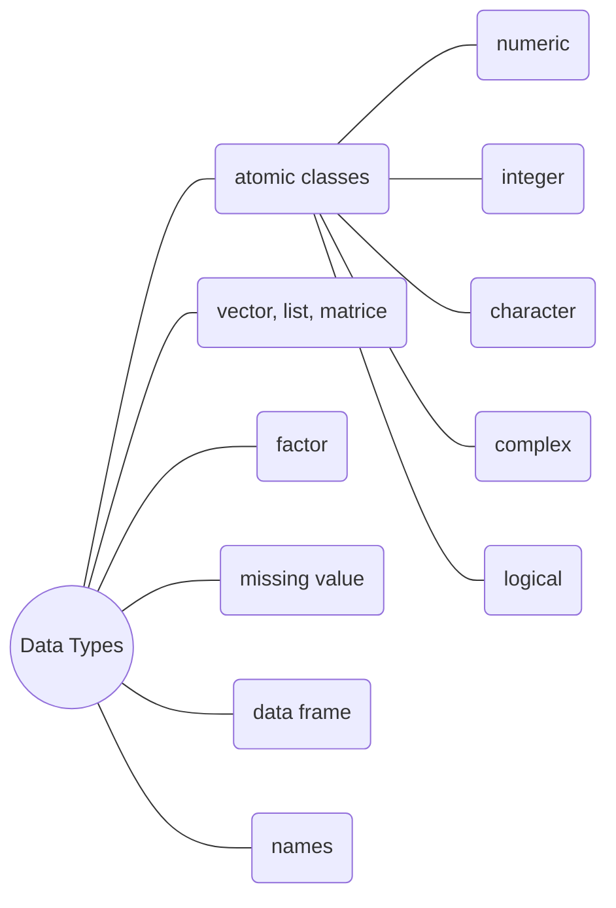

[TOC]

## R Objects and Attributes

### Objects

The five basic or "atomic" classes of objects:

- character
- numeric
- complex
- logical
- integer

The most basic object is *vector*

- A vector can only contain objects of same class
- Empty vector can be created with the `vector()`function

### Numbers 

- If you explicitly want an integer, you need to specify the `L` suffix
- There is a special **number** `Inf`  which represents **infinity**
- The value `NaN` represents an undefined value("**not a number**"), it can also be thought of as a **missing value**

### Attributes

R objects can have attributes:

- names, dimnames
- dimensions(e.g. matrices, arrays)
- class
- lengh
- other user-defined attributes/metadata

Attributes of an object can be accessed using the `attributes()` function


## Vectors and Lists

### Creating Vectors

- Using the  `c()` function
- Using the `vector()` function

### Explicit Coercion

Objects can be explicitly coerced from one class to another using the `as.*` functions, if available.

Nonsensical coercion results in `NA`

### Lists

Lists are a special vector that **can contain elements of different classes**. 

- Using the `list()` functions to create
- Lists have index


## Matrices

Matrices are vectors with **dimension** attribute. The dimension attribute is itself an integer vector of length 2 (nrow, ncol).

- Using the `matrix(nrow, ncol)` to create an empty matrices
- Matrices are constructed *column-wise*
- Matrices must have every element be the same class

```R
> m <- matrix(1:6, nrow = 2, ncol = 3)
> m
     [,1] [,2] [,3]
[1,]    1    3    5
[2,]    2    4    6
```

- Matrices can also created directly from vectors by adding a dimension attribute.

```R
> m <- 1:6
> m
[1] 1 2 3 4 5 6
> dim(m) <- c(2,3)
> m
     [,1] [,2] [,3]
[1,]    1    3    5
[2,]    2    4    6
```

Matrices can be created by column-binding or row-binding with `cbind()`  and `rbind` .

```R
>x <- 1:3
>y <- 4:6
>cbind(x,y)
> cbind(x,y)
     x y
[1,] 1 4
[2,] 2 5
[3,] 3 6
```


## Factors

Factors are used to represent **categorical data**. Factors can be unordered(e.g. male or female) or ordered(e.g. middle school, high school). One can think of a factor as an integer vector where each a **label**.

- Factors are treated specially by modeling functions like `lm()` and `glm()`
- Using factors with labels is better than using integers because factors are self-describing
- The order of the levels can be set using the `levels` argument to `factor()`

```R
> x <- factor(c("yes", "no", "yes", "yes", "no"))
> x
[1] yes no yes yes no
Levels: no yes
> table(x)
x
no yes 
 2   3
> unclass(x) #remove a vector class
[1] 2 1 2 2 1
attr(,"levels")
[1] "no" "yes"
> x <- factor(c("yes", "no", "yes", "yes", "no"), levels = c("yes", "no"))
>x
[1] yes no yes yes no
Levels: yes no
```


## Missing values

Missing values ate denoted bu `NA` or `NaN` for undefined mathematical operations.

- `is.na()` is used to test objects if they are `NA`
- `is.nan()` is used to test for `NaN`
- `NA` values have a class, so there are integer NA, character NA, etc.
- A `NaN` value is also `NA` but the converse is not true


## Data Frames

Data frames are used to store tabular data.

- Data frames can store different classes of objects in each column
- Data frames have a special attribute called `row.names()`
- It are created by calling `read.*()` or `data.frame()`
- Can be converted to a matrix by calling `data.matrix()`

```R
> x <- data.frame(foo = 1:4, bar = c("T", "T", "F", "F"))
> x
  foo bar
1   1   T
2   2   T
3   3   F
4   4   F
> nrow(x)
[1] 4
> ncol(x)
[1] 2
```


## Names Attribute

R objects can also have **names**, which is very useful for writing readable code and self-describing objects. 

```R
> #vectors
> x <- 1:3
> names(x)
NULL
> names(x) <- c("foo", "bar", "norf")
> x
 foo  bar norf 
   1    2    3 
> names(x)
[1] "foo"  "bar"  "norf"
> #matrices
> m <- matrix(1:4, 2, 2)
> m
     [,1] [,2]
[1,]    1    3
[2,]    2    4
> dimnames(m) <- list(c("r1", "r2"),c("c1", "c2"))
> m
   c1 c2
r1  1  3
r2  2  4
```


## Summary



## Reading Tabular Data

### Reading Data

There are a few principal functions reading data into R:

- `read.csv()`, `read.table()`, for reading tabular data
- `readLines()`, for reading lines of a text file
- `source()`, for reading in R code files (inverse of `dump()`)
- `dget()`, for reading in R code files (inverse of `dput()`) 
- `load()`, for reading in saved workplaces
- `unserialize()`, for reading single R objects in binary form

### Writing Data

There are analogous functions for writing data to files:

- `write.table()`
- `writeLines()`
- `dump()`
- `dput()`
- `save()`
- `serialize()`

### Reading Data Files with read.table

## Subsetting

There are a number of operators that can be used to extract subsets of R objects.

- `[]`returns an object of same class as the original
- `[[]]` is used to extract elements of a **list** or a **data frame**
- `$` is used to extract elements of a list or data frame by **name**

### Subsetting Vectors

```R
> x <- c("a", "b", "C")
> x[1]
[1] "a"
> x[x >= "b"]
[1] "b" "C"
> lg <- c(TRUE, FALSE, TRUE)
> x[lg]
[1] "a" "C"
```


### Subsetting Lists

```R
> x <- list(foo = 1:4, bar = 0.6)
> x[1]
$foo
[1] 1 2 3 4
> x[[1]]
[1] 1 2 3 4
> x$bar
[1] 0.6
> x["bar"]
$bar
[1] 0.6
```

