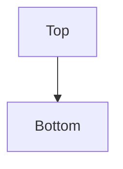
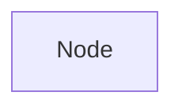
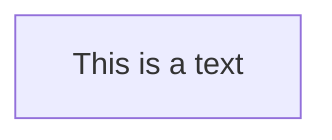
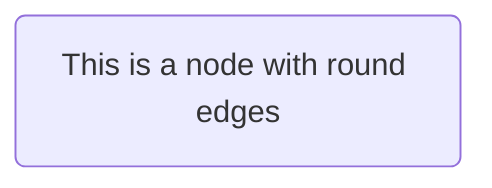
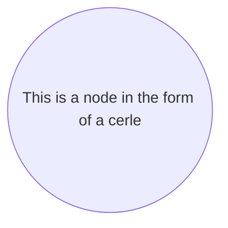
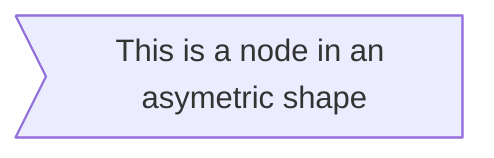
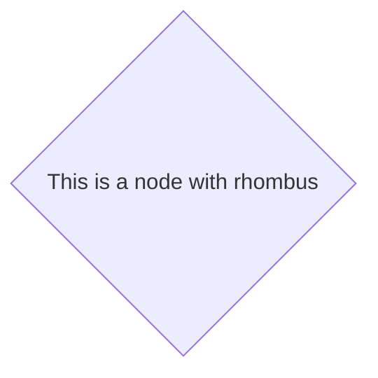
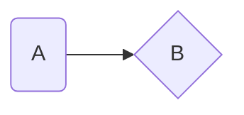
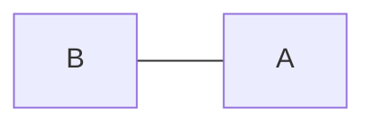

[TOC]

## Flowcharts

### Graph
```markdown
graph TB;
	Top --> Bottom;
```


### Nodes and Shapes

#### Node

```markdown
graph TD;
	Node;
```



- TB
- BT
- RL
- LR
- TD(same as TB)

#### A node with text 

```markdown 
graph TD;
	Node[This is a text];
```



#### A node with round edges

```markdown
graph TD;
	Node(This is a node with round edges);
```



#### A node in the form of a circle

```markdown
graph TD;
	Node((This is a node in the form of a cerle));
```



#### A node in an asymetric shape

```markdown 
graph TD;
	Node>This is a node in an asymetric shape];
```



#### A node with rhombus

```markdown
graph TD;
	Node{This is a node with rhombus}
```



### Links between nodes

#### A link with arrow head

```markdown
graph LR;
	A(A) --> B{B};
```



#### An open link

```markdown
graph RL;
	A --- B;
```



