[TOC]

## Flowcharts

### Graph
```markdown
graph TB;
	Top --> Bottom;
```

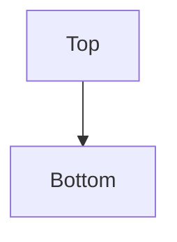
### Nodes and Shapes

#### Node

```markdown
graph TD;
	Node;
```

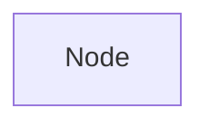

- TB
- BT
- RL
- LR
- TD(same as TB)

#### A node with text 

```markdown 
graph TD;
	Node[This is a text];
```

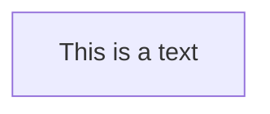

#### A node with round edges

```markdown
graph TD;
	Node(This is a node with round edges);
```

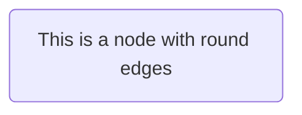

#### A node in the form of a circle

```markdown
graph TD;
	Node((This is a node in the form of a cerle));
```

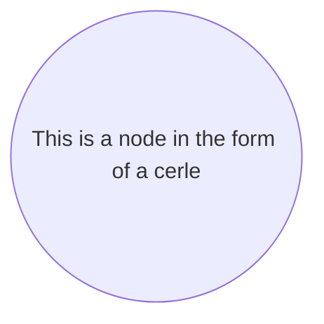

#### A node in an asymetric shape

```markdown 
graph TD;
	Node>This is a node in an asymetric shape];
```

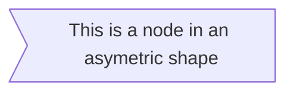

#### A node with rhombus

```markdown
graph TD;
	Node{This is a node with rhombus}
```

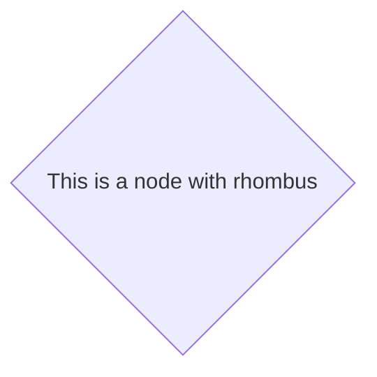

### Links between nodes

#### A link with arrow head

```markdown
graph LR;
	A(A) --> B{B};
```

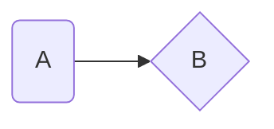

#### An open link

```markdown
graph RL;
	A --- B;
```

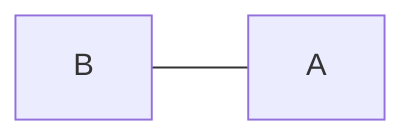

#### Text on links

```markdown
graph LR;
	A -- This is a text --- B;
```

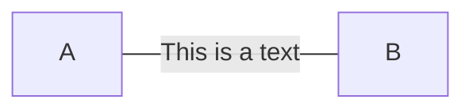

or 

```markdown
graph LR;
	A --- |This is a text| B;
```


#### A link with arrow head and text

```markdown
graph LR;
	A -- This is a text --> B;
```

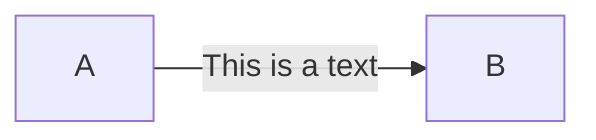

or 

```markdown
graph LR;
	A -->|This is a text| B;
```


#### Dotted link

```markdown
graph LR;
	A -.-> B;
```

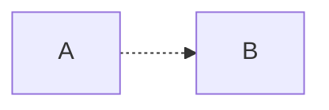

#### Dotted link with text 

```markdown
graph LR;
	A -. This is a text .-> B;
```

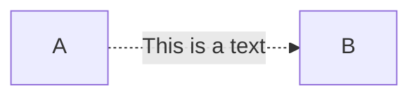

#### Thick link

```markdown
graph LR;
	A ==> B;
```

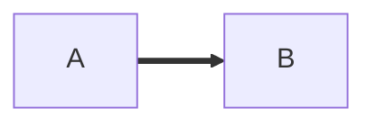

#### Thick link with text 

```markdown
graph LR;
	A == text==> B;
```

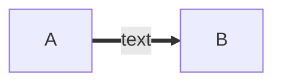

### Special characters that break syntax

```markdown
graph LR;
	Node["This is a node(text)"];
```

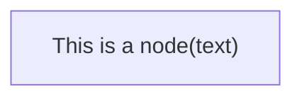

### Subgraphs

```markdown
subgraph title
	graph definition
end
```

```markdown
graph TB
	c1 --> a2
	subgraph one
	a1 --> a2
	end
	subgraph two
	b1 --> b2
	end
	subgraph three
	c1 --> c2
	end
```

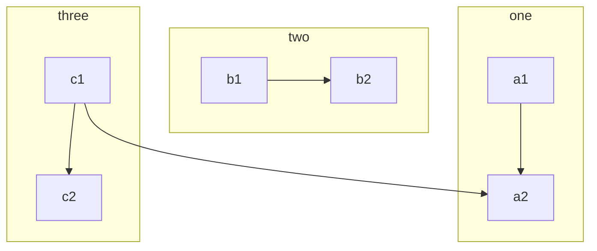

