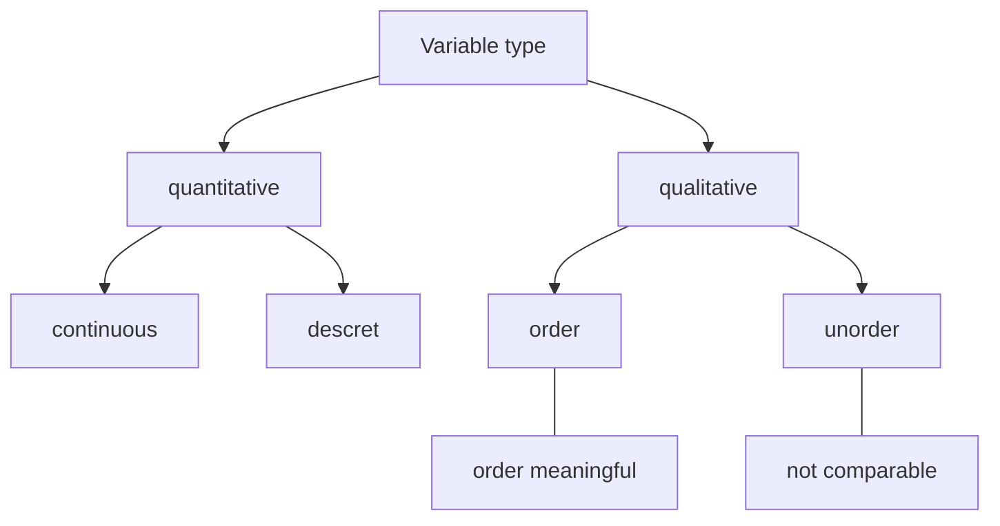

[TOC]

# Characterization of data

## Data foundation




## Characterization and visualization of numerical variables

- measures of center 

  - mean, median, mode

- measures of spread

  - range: max- min
  - variance


$$
\text{vanriance}=\frac{\sum_{n=1}^{n}(x_i-\bar x)^2}{n-1}
$$
  -	standard variance
$$
\text{sd}=\sqrt{\text{vanriance}}
$$
  - interquartile range

      robust statistics

  - yes: median, interquartile range(smallly affected by extreme value)

  - no: mean, sd, range(affected by extreme value)

     visualization of **a value**

  - histogram, dot plot

  - box plot(mode, interquartile range, extreme value)

     

  - relationship of **two values**

       -	scatter plot: direction, shape, strength, extreme value

## Characterization and visualization of qualitative

- Visualization of **a categorical variable**
  - frequency table, bar plot

- relationship of **two categorical variables**

  - contingency table, relative frequencies
  - segmentation, relative frequency segmentation plot
  - mosaic plot

- a categorical variable and a numerical variable relationship

  - side-by-side box plot

    

# R's drawing system

## R's three major drawing systems

- Base Plotting System
  - figure + modification/addition = perform a series of functions
  - suitable for drawing 2D images
- Lattice Plotting System
  - drawing = use once function
  - suitable for interaction between variables
- ggplot2 Plotting System
  - The grammar of graphics
  - = base +lattice

## Base Plotting System

- Graphics package

  - plot/hist/boxplot/points/lines/text/tile/axis

- plot()

  ```R
  plot(x,y,...)
  ```

  import parameters: `xlab/ylab/lwd/lty/pch/col`

- par()

  `bg/mar/las/mfrow/mfcol`

- Example

```R
with(airquality,plot(Wind,Temp,type = "n"))
title("The relationship between temp and wind")
with(subset(airquality,Month==5),points(Wind,Temp,col="red"))
with(subset(airquality,Month==6),points(Wind,Temp,col="blue"))
with(subset(airquality,Month==7),points(Wind,Temp,col="green"))
with(subset(airquality,Month==8),points(Wind,Temp,col="black"))
fit <- lm(Temp~Wind, airquality)
abline(fit, lwd = 2,col = "yellow")
legend("topright", pch = 1,col = c("red","blue","green","black"),legend = c(5,6,7,8))
```


## Lattice Plotting System

- lattice package

  - xyplot/bwplot/histogram/stripplot/dotplot/splom/levelplot/contourplot

    ```R
    xyplot(y~x|f*g,data)
    ```

  - panel function

- grid package

```R
xyplot(y~x|f, panel = function(x,y){
  panel.xyplot(x,y)
  panel.abline(v = mean(x),h = mean(y), lty = 2)
  panel.lmline(x,y,col = "red")
})
```


## ggplot2 Plotting System

- Layer

  | Data       | data frame                                                   |
  | :----------: | :-----------------------------------------------------------: |
  | Aesthetics | x-axis/y-axis/color/fill/size/labels/alpha/shape/linear width/linear type |
  | Geometries | point/line/histogram/bar/boxplot |
  | Facets | columns/rows |
  | Statistics | binning/smoothing/descriptive/inferential |
  | Coordinates | cartesian/fixed/polar/limits |
  | Themes | non-data ink |

- 