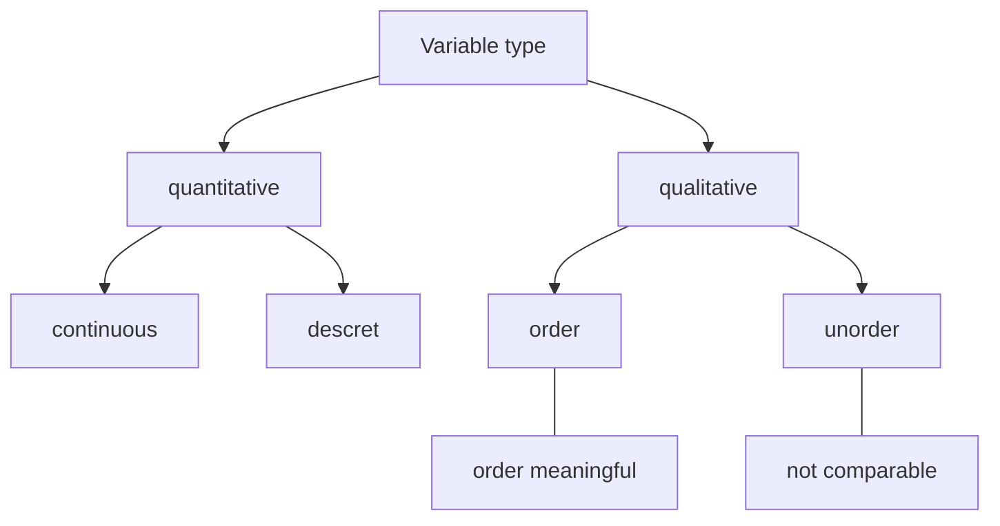

[TOC]

## Data foundation

## Characterization and visualization of numerical variables

- measures of center 

  - mean, median, mode

- measures of spread

  - range: max- min
  - variance

$$
\text{vanriance}=\frac{\sum_{n=1}^{n}(x_i-\bar x)^2}{n-1}
$$
  -	standard variance
$$
  \text{sd}=\sqrt{\text{vanriance}}
$$
  -	interquartile range

		robust statistics

  - yes: median, interquartile range(smallly affected by extreme value)
  - no: mean, sd, range(affected by extreme value)

		visualization of **a value**

  - histogram, dot plot
  - box plot(mode, interquartile range, extreme value)

		relationship of **two values**

  - scatter plot: direction, shape, strength, extreme value

## Characterization and visualization of qualitative

- Visualization of **a categorical variable**
  - frequency table, bar plot
- relationship of **two categorical variables**
  - contingency table, relative frequencies