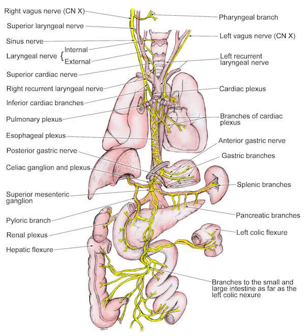

知道为什么耳机末端有一个孔（下图标出的那个孔）吗？

 

 

 

 

 

这些洞不是为了满足你的审美观念，也不是为了通过节省塑料为生产公司节省5万美元。那里也不是麦克风，因为麦克风在调音量那里。

那个孔的作用是**让你的音乐听起来更棒。**

扬声器通过用电磁铁振动锥体来工作。这将声波推入空中，产生噪音。但是锥体的振动会产生压力，使扬声器振动变得困难。因此制造商通过挖孔来解决了这个问题。

这些孔让空气流入和流出扬声器，从而防止压力累积，使耳机的扬声器可以更自由地移动。这最终有助于创造更好的声学效果和更深沉的低音。

我看见评论区有人竟然将这个和耳屎联系在一起，那么我再科普一个知识：

你用掏耳勺（或者其它东西）处理耳垢时，理论上会致死。

原因？

**刺激迷走神经导致心脏骤停。**

那么实际上呢？

**当刺激到迷走神经时，只有患有某些特殊疾病的人才会致死，正常人只会产生咳嗽的感觉**（相信一定有同感吧，手动滑稽）。

下图为迷走神经:-)

Vagus nerve

于是又有小伙伴问了，为什么叫迷走神经？

这还用说吗，当然是因为它的蜜汁走位了。

正经回答：

**迷走神经**（vagus nerve）是脑神经，亦称**第十对脑神经**（tenth cranial nerve）， 编号X。

迷走神经是人体中最长的脑神经，连接**口副交感神经**的控制心脏，肺和消化道。随意行走于腹部，其末梢弥漫在腹腔、胸腔及各个器官，分散复杂不易区分，另vagus是拉丁语中的wandering，因此名作“迷走”神经。

说来还是它在人体中的蜜汁走位嘛（再手动滑稽）

 

 

 

 